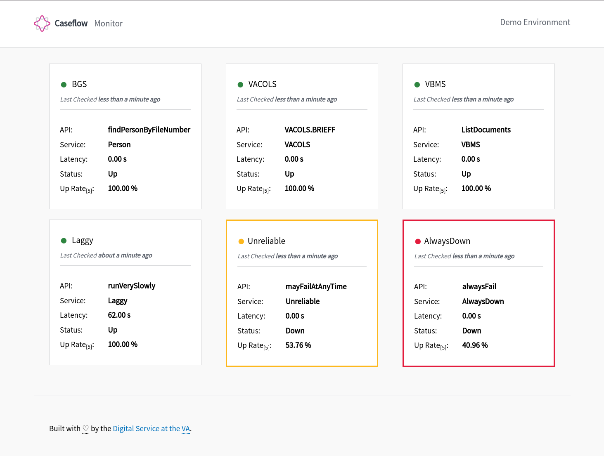

# Caseflow Monitor

Caseflow Monitor is a Rails application that monitors the backend services used by [Caseflow](https://github.com/department-of-veterans-affairs/caseflow). The primary backend services includes

 - [BGS](https://github.com/department-of-veterans-affairs/ruby-bgs)
 - VACOLS
 - [VBMS](https://github.com/department-of-veterans-affairs/connect_vbms)

Caseflow Monitor periodically pings the service endpoints to monitor its uptime and latency.

## Screenshot

